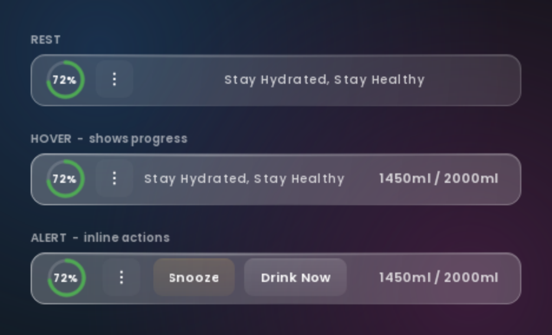
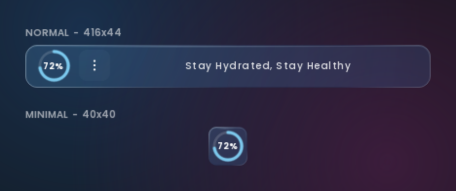
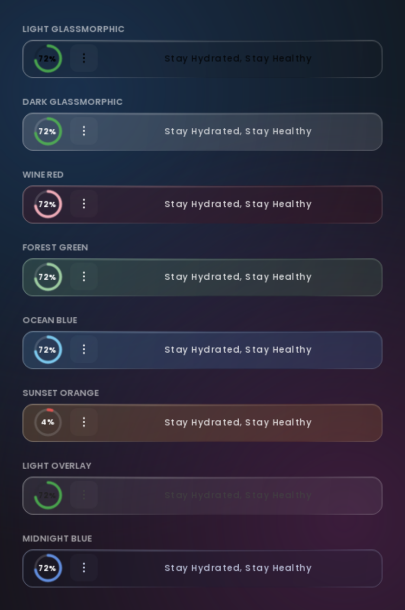
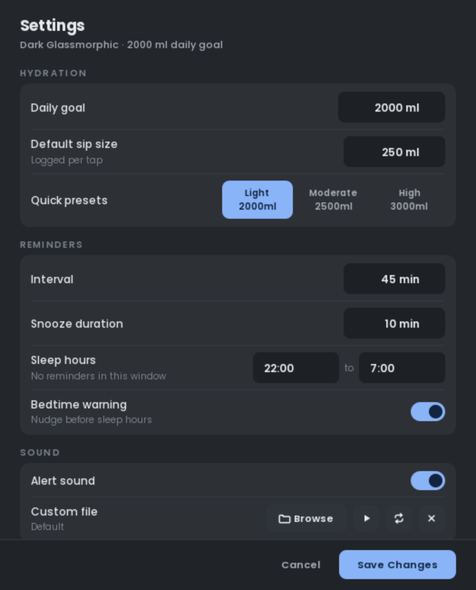

# HydraPing

**A hydration reminder that lives on your desktop without taking it over.**

Most water trackers make you open an app to use them. HydraPing sits on top of whatever
you are already doing, as a thin glass bar or a single 40-pixel dot, and gets out of the
way until it matters.



---

## Two ways to wear it

Some days you want the full readout. Some days you want a dot.



**Normal** gives you the progress ring, a rotating message, and your running total on
hover. **Minimal** strips it to a 40x40 square the size of a taskbar icon, showing only
your progress ring, and expands itself automatically when a reminder fires, so you never
miss one for the sake of a clean desktop.

Drag it anywhere. Double-click for settings. It stays above other windows without
stealing focus from what you are typing into.

---

## It learns when you actually drink

A fixed timer nags you at 3pm whether you drank at 2:55 or not at all since breakfast.
HydraPing watches your pattern over one to two weeks and predicts when you will next
need water, with an honest confidence score attached.

- Reminders adapt to your real rhythm instead of a stopwatch
- Predictions come with a confidence rating, and low-confidence guesses stay quiet
- Outliers get filtered out, so one unusual day does not skew a fortnight of data
- Reminders snap to the nearest five-minute mark, so they land on clock time
- Sleep hours pause everything, with an optional nudge before bed

If it does not have enough data to be useful yet, it says nothing rather than guessing.

---

## Eight themes, and they actually change everything



Pick a theme and the whole application follows it, including the settings window and
its native title bar. Light themes get a genuinely light interface, not a dark one with
lighter accents.

---

## Settings that respect your time



Grouped, scrollable, and themed to match the overlay it configures. Destructive actions
live in their own clearly marked zone rather than sitting next to Save.

Everything is adjustable: daily goal, reminder interval, sip size, snooze duration,
sleep window, alert sound, and startup behaviour. Quick presets cover the common cases.

---

## Getting started

Grab `HydraPing.exe` from the releases page and run it. No installer, no dependencies,
no account. A single 26 MB file.

Your data stays on your machine in a local SQLite database under
`%APPDATA%/HydraPing`. Nothing is uploaded anywhere.

**Requirements:** Windows 10 or 11.

---

## Running from source

```bash
git clone https://github.com/vinayakawac/HydraPing_win.git
cd HydraPing_win
pip install -r requirements.txt
python main.py
```

Building your own executable:

```bash
pyinstaller HydraPing.spec
```

The result lands in `dist/HydraPing.exe`.

---

## Under the hood

Python and PySide6, with the overlay drawn directly through QPainter rather than
assembled from styled widgets. The glass edge is a single path carrying both fill and
rim, which is what keeps the corners clean at any display scaling.

Storage is SQLite. The title bar is tinted through the Windows compositor rather than
replaced with a custom frame, so window snapping, dragging and animations all behave
exactly as Windows intends.

```
main.py              Application controller and reminder loop
overlay_window.py    The glass overlay
settings_dialog.py   Settings window
theme_manager.py     Themes and palettes
layouts/             Normal and minimal layout definitions
core/                Data, patterns, context detection, autostart
```

---

## License

Open source, free for personal and educational use. See [LICENSE](LICENSE).

Contributions welcome. Fork it, build something, open a pull request.
